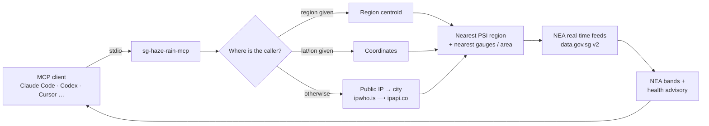

<div align="center">

# 🌫️ sg-haze-rain-mcp

**Ask your AI agent "how's the haze?" and get Singapore's live PSI, PM2.5 and rain, straight from NEA, for exactly where you are.**

[](https://github.com/ericwang915/sg-haze-rain-mcp/actions/workflows/ci.yml)
[](LICENSE)
[](https://nodejs.org)
[](https://modelcontextprotocol.io)
[](https://data.gov.sg)
[](CONTRIBUTING.md)

[English](README.md) · [简体中文](README.zh-CN.md)

[](https://cursor.com/en/install-mcp?name=sg-haze-rain&config=eyJjb21tYW5kIjoibnB4IiwiYXJncyI6WyIteSIsImdpdGh1Yjplcmljd2FuZzkxNS9zZy1oYXplLXJhaW4tbWNwIl19)
[](https://vscode.dev/redirect/mcp/install?name=sg-haze-rain&config=%7B%22command%22%3A%22npx%22%2C%22args%22%3A%5B%22-y%22%2C%22github%3Aericwang915%2Fsg-haze-rain-mcp%22%5D%7D)

</div>

---

Every haze season, Singaporeans refresh the NEA app, squint at five regional numbers and try to remember what "Unhealthy" means for a 6 pm run. **sg-haze-rain-mcp** puts that knowledge inside the AI tools you already have open. It is a zero-config [Model Context Protocol](https://modelcontextprotocol.io) server for **Claude Code, Codex, Claude Desktop, Cursor, VS Code, Windsurf, Zed** and any other MCP client.

- 🧭 **Knows where you are.** Geolocates your public IP and picks the nearest of NEA's five PSI regions. Or pass a region, coordinates or an IP explicitly.
- 🏥 **Speaks NEA's language.** Every reading comes with the official band and the three-tier health advisory (general public · elderly, pregnant women and children · chronic lung or heart conditions).
- 🌧️ **Rain, not just haze.** Nearest three rain gauges with 5-minute totals, the 2-hour area nowcast, and how many of ~90 gauges are wet island-wide.
- 🔑 **No API key, no account.** Pure public data. One `npx` command and you are done.
- 🌏 **English and Chinese** labels and advisories, per call or by default.
- 🤖 **Agent-friendly.** Human-readable text plus `structuredContent` JSON in every result, so an agent can quote the summary or branch on the numbers.

```text
> how's the haze right now, and can I run at 6?

🌫️ Singapore haze — 28 Sept 2026, 21:46 SGT
Location: Bishan, Singapore → nearest PSI region: central (located via public IP)

24-hr PSI: 108 — Unhealthy (101–200)
1-hr PM2.5: 119 µg/m³ — Elevated (Band II)
24-hr PM2.5: 63 µg/m³ · 24-hr PM10: 72 µg/m³

Health advisory (Unhealthy):
• General public: Reduce prolonged or strenuous outdoor physical exertion.
• Elderly, pregnant women, children: Minimise prolonged or strenuous outdoor physical exertion.
• Chronic lung / heart conditions: Avoid prolonged or strenuous outdoor physical exertion.

All regions (24-hr PSI): north 75 · south 105 · east 90 · west 101 · central 108

☀️ No rain nearby — 21:45 SGT
• Macritchie Reservoir (1.9 km): 0 mm  • Lower Peirce Reservoir (2.1 km): 0 mm  • Upper Peirce (2.6 km): 0 mm
2-hour forecast Bishan: Cloudy — 9.30 pm to 11.30 pm
Island-wide: 0/89 stations reporting rain
```

## Quick start

Requires **Node.js 18.17+** (`node --version`). Nothing else: no sign-up, no key.

<details open>
<summary><b>Claude Code</b></summary>

```bash
claude mcp add --scope user sg-haze-rain -- npx -y github:ericwang915/sg-haze-rain-mcp
```

Prefer Chinese labels by default:

```bash
claude mcp add --scope user --env SG_HAZE_LANG=zh sg-haze-rain -- npx -y github:ericwang915/sg-haze-rain-mcp
```

Run `/mcp` inside Claude Code to confirm the server is connected with five tools. To share with a team, commit a project-level [`.mcp.json`](.mcp.json.example) instead.
</details>

<details>
<summary><b>Codex CLI</b></summary>

```bash
codex mcp add sg-haze-rain -- npx -y github:ericwang915/sg-haze-rain-mcp
```

or in `~/.codex/config.toml`:

```toml
[mcp_servers.sg_haze_rain]
command = "npx"
args = ["-y", "github:ericwang915/sg-haze-rain-mcp"]
# env = { SG_HAZE_LANG = "zh" }
```
</details>

<details>
<summary><b>Claude Desktop</b></summary>

Add to `claude_desktop_config.json` (macOS: `~/Library/Application Support/Claude/`, Windows: `%APPDATA%\Claude\`):

```json
{
  "mcpServers": {
    "sg-haze-rain": {
      "command": "npx",
      "args": ["-y", "github:ericwang915/sg-haze-rain-mcp"]
    }
  }
}
```
</details>

<details>
<summary><b>Cursor · VS Code · Windsurf · Zed · Cline · anything else</b></summary>

Use the one-click badges at the top, or paste the same `command` / `args` pair into that client's MCP config (`.cursor/mcp.json`, `.vscode/mcp.json`, …):

```json
{ "command": "npx", "args": ["-y", "github:ericwang915/sg-haze-rain-mcp"] }
```
</details>

<details>
<summary><b>Pin a version, install globally, or run from a clone</b></summary>

```bash
# pin to a release tag
npx -y "github:ericwang915/sg-haze-rain-mcp#v0.1.0"

# install once, then reference the binary
npm install -g github:ericwang915/sg-haze-rain-mcp
claude mcp add sg-haze-rain -- sg-haze-rain-mcp

# hack on it
git clone https://github.com/ericwang915/sg-haze-rain-mcp.git && cd sg-haze-rain-mcp
npm install            # builds dist/ via prepare
claude mcp add sg-haze-rain -- node "$PWD/dist/index.js"
```

The first `npx` run downloads and builds (about 20 s); later starts come from the npx cache and are instant.
</details>

### Things to ask

- *"How's the haze right now?"*
- *"Is it safe for my kids to play outside this afternoon?"*
- *"Will it rain in the next two hours in Jurong?"*
- *"Compare PSI across all regions."*
- *"What's the 4-day outlook?"*
- *"Should I bring an umbrella to Changi at 5 pm?"*

## Tools

| Tool | Purpose | Key fields in `structuredContent` |
|---|---|---|
| **`weather_now`** | One call: haze + rain + 2-hour forecast for your spot. Start here. | `haze`, `rain` |
| **`get_haze`** | 24-hr PSI, 1-hr PM2.5, 24-hr PM2.5 / PM10, NEA band, advisory, all five regions, pollutant sub-indices. | `psi24h`, `psiBand`, `pm25_1h`, `advisory`, `allRegions`, `subIndices` |
| **`get_rain`** | Nearest three gauges (5-minute totals), 2-hour area forecast, island-wide wet-station count. | `rainingNearby`, `rainExpectedWithin2h`, `nearestStations`, `twoHourForecast` |
| **`get_forecast`** | `horizon: "2h"` area nowcast · `"24h"` (default) general + your region per period · `"4d"` outlook. | `periods`, `days`, `nearestAreas` |
| **`locate_me`** | Shows the location and PSI region the other tools will use, and how it was decided. | `location`, `region` |

All tools take the same optional inputs: `region` (`north` · `south` · `east` · `west` · `central`), `lat` + `lon`, `ip`, `lang` (`en` · `zh`).

One prompt ships too: **`haze_check`** (`activity: "run 5 km at 6pm"`) asks the assistant for a plain-language go / no-go based on the current readings.

## How it works



Location resolution is strictly ordered: an explicit `region` wins, then `lat`/`lon`, then a given `ip`, then the machine's own public IP. If the IP lands outside Singapore or the lookup fails, the server falls back to a default region and **says so in the reply**, so the agent never silently reports the wrong place.

Feeds are cached in-process for 60 s. data.gov.sg rate-limits bursts with HTTP 429; the client retries with backoff, honours `Retry-After`, and if the feed still refuses it serves the last good copy it holds rather than failing a "how is the haze" question.

## Data

Everything comes from the **National Environment Agency (NEA)**, published on Singapore's open-data platform [data.gov.sg](https://data.gov.sg). No key, same data as the NEA app.

| Feed | Endpoint (`https://api-open.data.gov.sg/v2/real-time/api/…`) | Refresh |
|---|---|---|
| 24-hr PSI, 24-hr PM2.5 / PM10, pollutant sub-indices, 5 regions | `psi` | hourly |
| 1-hr PM2.5, 5 regions | `pm25` | hourly |
| Rainfall, 5-minute totals, ~90 gauges | `rainfall` | every 5 min |
| 2-hour area forecast, 47 areas | `two-hr-forecast` | every 30 min |
| 24-hour forecast, general + regional periods | `twenty-four-hr-forecast` | several times daily |
| 4-day outlook | `four-day-outlook` | daily |

### NEA bands, as reported

**24-hr PSI**

| PSI | Band | General public |
|---|---|---|
| 0–50 | Good | Normal activities |
| 51–100 | Moderate | Normal activities |
| 101–200 | Unhealthy | Reduce prolonged or strenuous outdoor exertion |
| 201–300 | Very Unhealthy | Avoid prolonged or strenuous outdoor exertion |
| > 300 | Hazardous | Minimise outdoor activity; N95 for anyone outdoors for hours |

Replies also include the stricter guidance NEA gives for the elderly, pregnant women, children, and people with chronic lung or heart disease.

**1-hr PM2.5** (µg/m³), NEA's indicator for the coming hours: 0–55 Normal (I) · 56–150 Elevated (II) · 151–250 High (III) · > 250 Very High (IV).

## Privacy

With no location inputs, the server asks a public IP-geolocation service where your public IP is: [ipwho.is](https://ipwho.is) first, [ipapi.co](https://ipapi.co) as fallback. Both are free and keyless. Only the returned coordinates and city name are used; nothing is stored. Resolution is city-level, and a VPN or corporate egress will move you.

Do not want that call at all?

- `SG_HAZE_IP_LOOKUP=off` (optionally with `SG_HAZE_DEFAULT_REGION=west`), or
- always pass `region` or `lat` / `lon` from the client.

Requests to NEA / data.gov.sg carry no information about you; the feeds are identical for everyone.

## Configuration

| Variable | Default | Effect |
|---|---|---|
| `SG_HAZE_IP_LOOKUP` | `on` | `off` disables IP geolocation entirely |
| `SG_HAZE_DEFAULT_REGION` | `central` | Region used when location is unknown or outside Singapore |
| `SG_HAZE_LANG` | `en` | `zh` for Chinese labels and advisories; per-call `lang` overrides |
| `SG_HAZE_CACHE_SECONDS` | `60` | How long a fetched feed is reused |
| `SG_HAZE_API_BASE` | data.gov.sg v2 URL | Point at a mirror or a test server |

Pass them with `--env KEY=value` in `claude mcp add`, an `env` table in Codex's `config.toml`, or an `env` object in JSON configs.

## Development

```bash
npm install          # installs and builds
npm run build        # tsc → dist/
npm test             # build + stdio smoke test against the live feeds
node dist/index.js --help
```

[`test/smoke.mjs`](test/smoke.mjs) speaks raw JSON-RPC to the built server, lists the tools and calls each one with explicit regions or coordinates. It sets `SG_HAZE_IP_LOOKUP=off`, so running the tests never geolocates your machine. CI runs it on Node 18, 20 and 22.

```
src/index.ts    stdio entry point, --help / --version
src/server.ts   tool + prompt definitions, text formatting (en / zh)
src/nea.ts      NEA feed client: camel/snake normalisation, cache, 429 handling
src/geo.ts      region / coords / IP resolution, haversine nearest-neighbour
src/bands.ts    PSI and PM2.5 bands and NEA health advisories
```

## Roadmap

- [ ] UV index, air temperature, humidity and wind from the same NEA feed family
- [ ] Haze trend: compare the current PSI with 3 and 6 hours ago
- [ ] Optional HTTP / SSE transport for hosted deployments
- [ ] More languages for labels and advisories (Malay, Tamil)

Have a use case? [Open an issue](https://github.com/ericwang915/sg-haze-rain-mcp/issues) or see [CONTRIBUTING.md](CONTRIBUTING.md).

## FAQ

**Does it need npm?** It needs Node.js 18.17+. `npx` ships with Node, so if you can run Claude Code or Codex you already have everything.

**Why five regions and not my street?** NEA publishes PSI for north, south, east, west and central only. Rain, however, is gauge-level, so the nearest three gauges are usually within 2–3 km.

**Is this official?** No. It relays NEA's published data unchanged. For official advisories see [haze.gov.sg](https://www.haze.gov.sg) and [nea.gov.sg](https://www.nea.gov.sg).

**I am outside Singapore.** The server notices, uses the default region, and tells the agent so. Pass `region` to pick one deliberately.

## License

[MIT](LICENSE). Data © National Environment Agency, Singapore, under the [Singapore Open Data Licence](https://data.gov.sg/open-data-licence).

<div align="center">

If this saves you a trip to the NEA app, a ⭐ helps other Singaporeans find it.

</div>
