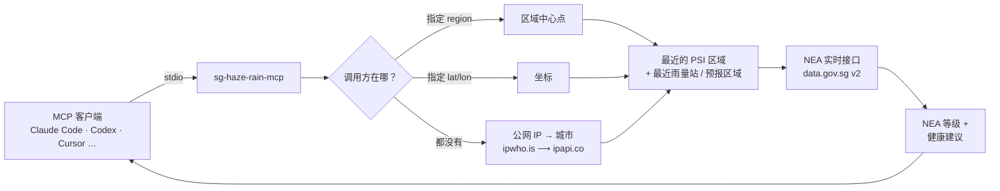

<div align="center">

# 🌫️ sg-haze-rain-mcp

**问一句「现在烟霾怎么样」，AI 助手就告诉你所在位置的实时 PSI、PM2.5 和降雨，数据直接来自 NEA。**

[](https://github.com/ericwang915/sg-haze-rain-mcp/actions/workflows/ci.yml)
[](LICENSE)
[](https://nodejs.org)
[](https://modelcontextprotocol.io)
[](https://data.gov.sg)

[English](README.md) · [简体中文](README.zh-CN.md)

[](https://cursor.com/en/install-mcp?name=sg-haze-rain&config=eyJjb21tYW5kIjoibnB4IiwiYXJncyI6WyIteSIsImdpdGh1Yjplcmljd2FuZzkxNS9zZy1oYXplLXJhaW4tbWNwIl19)
[](https://vscode.dev/redirect/mcp/install?name=sg-haze-rain&config=%7B%22command%22%3A%22npx%22%2C%22args%22%3A%5B%22-y%22%2C%22github%3Aericwang915%2Fsg-haze-rain-mcp%22%5D%7D)

</div>

---

每到烟霾季，大家都在刷 NEA 的 app，对着五个区域的数字琢磨「不健康」到底还能不能出去跑步。**sg-haze-rain-mcp** 把这件事交给你已经打开的 AI 工具。它是一个零配置的 [Model Context Protocol](https://modelcontextprotocol.io) 服务器，支持 **Claude Code、Codex、Claude Desktop、Cursor、VS Code、Windsurf、Zed** 等所有 MCP 客户端。

- 🧭 **知道你在哪。** 通过公网 IP 定位，选出 NEA 五个 PSI 区域中最近的一个。也可以显式指定区域、坐标或 IP。
- 🏥 **用 NEA 的口径说话。** 每个读数都附带官方等级和三类人群的健康建议（一般人群 · 老人、孕妇、儿童 · 慢性肺病或心脏病患者）。
- 🌧️ **不只烟霾，还有雨。** 最近三个雨量站的 5 分钟降雨量、2 小时区域短时预报、全岛约 90 个站点中有多少在下雨。
- 🔑 **不需要 API key，不需要注册。** 纯公开数据，一条 `npx` 命令搞定。
- 🌏 **中英文**标签和健康建议，可按次或按默认设置。
- 🤖 **对 agent 友好。** 每次结果同时给出可读文本和 `structuredContent` JSON，agent 既能引用摘要也能按数值做判断。

```text
> 现在烟霾怎么样？六点能跑步吗？

🌫️ 新加坡烟霾 — 28 Sept 2026, 21:46 SGT
位置: Bishan, Singapore → 最近的 PSI 区域: 中部 (通过公网 IP 定位)

24小时 PSI: 108 — 不健康 (101–200)
1小时 PM2.5: 119 µg/m³ — 偏高 (等级 II)
24小时 PM2.5: 63 µg/m³ · 24小时 PM10: 72 µg/m³

健康建议 (不健康):
• 一般人群: 减少长时间或剧烈的户外活动。
• 老人、孕妇、儿童: 尽量减少长时间或剧烈的户外活动。
• 慢性肺病或心脏病患者: 避免长时间或剧烈的户外活动。

各区域 24小时 PSI: 北部 75 · 南部 105 · 东部 90 · 西部 101 · 中部 108

☀️ 附近没有下雨 — 21:45 SGT
• Macritchie Reservoir (1.9 km): 0 mm  • Lower Peirce Reservoir (2.1 km): 0 mm  • Upper Peirce (2.6 km): 0 mm
2小时预报 Bishan: Cloudy — 9.30 pm to 11.30 pm
全岛: 0/89 个站点有雨
```

## 快速开始

只需要 **Node.js 18.17 以上**（`node --version`）。不用注册账号，不用申请 key。

<details open>
<summary><b>Claude Code</b></summary>

```bash
claude mcp add --scope user --env SG_HAZE_LANG=zh sg-haze-rain -- npx -y github:ericwang915/sg-haze-rain-mcp
```

去掉 `--env SG_HAZE_LANG=zh` 则默认英文。装好后在 Claude Code 里输入 `/mcp`，应能看到服务器已连接、五个工具可用。想让团队共享，可以在项目里提交一份 [`.mcp.json`](.mcp.json.example)。
</details>

<details>
<summary><b>Codex CLI</b></summary>

```bash
codex mcp add sg-haze-rain -- npx -y github:ericwang915/sg-haze-rain-mcp
```

或写入 `~/.codex/config.toml`：

```toml
[mcp_servers.sg_haze_rain]
command = "npx"
args = ["-y", "github:ericwang915/sg-haze-rain-mcp"]
env = { SG_HAZE_LANG = "zh" }
```
</details>

<details>
<summary><b>Claude Desktop</b></summary>

编辑 `claude_desktop_config.json`（macOS 在 `~/Library/Application Support/Claude/`，Windows 在 `%APPDATA%\Claude\`）：

```json
{
  "mcpServers": {
    "sg-haze-rain": {
      "command": "npx",
      "args": ["-y", "github:ericwang915/sg-haze-rain-mcp"],
      "env": { "SG_HAZE_LANG": "zh" }
    }
  }
}
```
</details>

<details>
<summary><b>Cursor · VS Code · Windsurf · Zed · Cline 等</b></summary>

点顶部的一键安装徽章，或在对应客户端的 MCP 配置（`.cursor/mcp.json`、`.vscode/mcp.json` 等）里填入：

```json
{ "command": "npx", "args": ["-y", "github:ericwang915/sg-haze-rain-mcp"] }
```
</details>

<details>
<summary><b>锁定版本、全局安装、或从源码运行</b></summary>

```bash
# 锁定到某个发布 tag
npx -y "github:ericwang915/sg-haze-rain-mcp#v0.1.0"

# 全局安装一次，之后直接引用可执行文件
npm install -g github:ericwang915/sg-haze-rain-mcp
claude mcp add sg-haze-rain -- sg-haze-rain-mcp

# 改代码
git clone https://github.com/ericwang915/sg-haze-rain-mcp.git && cd sg-haze-rain-mcp
npm install            # 会通过 prepare 脚本自动编译 dist/
claude mcp add sg-haze-rain -- node "$PWD/dist/index.js"
```

首次 `npx` 需要下载并编译，约 20 秒；之后走 npx 缓存，秒开。
</details>

### 可以这样问

- 「现在烟霾怎么样？」
- 「今天下午小孩能在外面玩吗？」
- 「裕廊两小时内会下雨吗？」
- 「对比一下各区域的 PSI。」
- 「未来四天天气如何？」
- 「五点去樟宜要带伞吗？」

## 工具

| 工具 | 用途 | `structuredContent` 关键字段 |
|---|---|---|
| **`weather_now`** | 一次调用：烟霾 + 降雨 + 2小时预报。从这里开始。 | `haze`, `rain` |
| **`get_haze`** | 24小时 PSI、1小时 PM2.5、24小时 PM2.5 / PM10、NEA 等级、健康建议、五区对比、污染物分指数。 | `psi24h`, `psiBand`, `pm25_1h`, `advisory`, `allRegions`, `subIndices` |
| **`get_rain`** | 最近三个雨量站（5 分钟累计）、2小时区域预报、全岛有雨站点数。 | `rainingNearby`, `rainExpectedWithin2h`, `nearestStations`, `twoHourForecast` |
| **`get_forecast`** | `horizon: "2h"` 区域短时预报 · `"24h"`（默认）总体 + 所在区域分时段 · `"4d"` 四天展望。 | `periods`, `days`, `nearestAreas` |
| **`locate_me`** | 查看其他工具将使用的位置与区域，以及判断依据。 | `location`, `region` |

所有工具接受相同的可选参数：`region`（`north` · `south` · `east` · `west` · `central`）、`lat` + `lon`、`ip`、`lang`（`en` · `zh`）。

另附一个 prompt：**`haze_check`**（`activity: "run 5 km at 6pm"`），让助手根据当前读数给出一句话的能不能出门。

## 工作原理



位置判定有严格的优先级：显式 `region` 最高，其次 `lat`/`lon`，再次传入的 `ip`，最后才是本机公网 IP。如果 IP 在新加坡以外或定位失败，退回默认区域，并**在回复里明确说明**，agent 不会悄悄报错地方。

接口数据在进程内缓存 60 秒。data.gov.sg 对突发请求会返回 HTTP 429；客户端会带退避重试、遵守 `Retry-After`，仍失败时返回上一次的有效数据而不是让「现在烟霾怎么样」这个问题落空。

## 数据

全部来自**新加坡国家环境局（NEA）**，经开放数据平台 [data.gov.sg](https://data.gov.sg) 发布。不需要 key，与 NEA app 同源。

| 接口 | 路径（`https://api-open.data.gov.sg/v2/real-time/api/…`） | 更新频率 |
|---|---|---|
| 24小时 PSI、24小时 PM2.5 / PM10、污染物分指数，5 个区域 | `psi` | 每小时 |
| 1小时 PM2.5，5 个区域 | `pm25` | 每小时 |
| 降雨 5 分钟累计，约 90 个站点 | `rainfall` | 每 5 分钟 |
| 2小时区域预报，47 个区域 | `two-hr-forecast` | 每 30 分钟 |
| 24小时预报，总体 + 分区域分时段 | `twenty-four-hr-forecast` | 每日数次 |
| 4天展望 | `four-day-outlook` | 每日 |

### NEA 等级

**24小时 PSI**

| PSI | 等级 | 一般人群 |
|---|---|---|
| 0–50 | 良好 | 可正常活动 |
| 51–100 | 中等 | 可正常活动 |
| 101–200 | 不健康 | 减少长时间或剧烈的户外活动 |
| 201–300 | 非常不健康 | 避免长时间或剧烈的户外活动 |
| > 300 | 危险 | 尽量减少户外活动；需在户外数小时者佩戴 N95 |

回复同时包含 NEA 对老人、孕妇、儿童以及慢性肺病或心脏病患者的更严格建议。

**1小时 PM2.5**（µg/m³），NEA 用于判断接下来几小时的指标：0–55 正常 (I) · 56–150 偏高 (II) · 151–250 高 (III) · > 250 非常高 (IV)。

## 隐私

不传位置参数时，服务器会向公开的 IP 定位服务查询本机公网 IP 所在城市：先 [ipwho.is](https://ipwho.is)，失败则 [ipapi.co](https://ipapi.co)。两者免费、无需 key。只使用返回的坐标和城市名，不做任何存储。精度为城市级，使用 VPN 或公司出口会导致偏移。

完全不想有这次请求？

- 设置 `SG_HAZE_IP_LOOKUP=off`（可搭配 `SG_HAZE_DEFAULT_REGION=west`），或
- 每次调用都从客户端传 `region` 或 `lat` / `lon`。

发往 NEA / data.gov.sg 的请求不携带任何关于你的信息，所有人拿到的数据一样。

## 配置

| 变量 | 默认 | 作用 |
|---|---|---|
| `SG_HAZE_IP_LOOKUP` | `on` | `off` 完全关闭 IP 定位 |
| `SG_HAZE_DEFAULT_REGION` | `central` | 位置未知或在新加坡以外时使用的区域 |
| `SG_HAZE_LANG` | `en` | `zh` 使用中文标签和建议；单次调用的 `lang` 优先 |
| `SG_HAZE_CACHE_SECONDS` | `60` | 接口数据复用时长 |
| `SG_HAZE_API_BASE` | data.gov.sg v2 地址 | 指向镜像或测试服务器 |

在 `claude mcp add` 中用 `--env KEY=value`，Codex 的 `config.toml` 用 `env` 表，JSON 配置用 `env` 对象。

## 开发

```bash
npm install          # 安装并编译
npm run build        # tsc → dist/
npm test             # 编译 + 对真实接口的 stdio 烟雾测试
node dist/index.js --help
```

[`test/smoke.mjs`](test/smoke.mjs) 用原始 JSON-RPC 与编译后的服务器对话，列出工具并用显式区域或坐标逐个调用。它设置了 `SG_HAZE_IP_LOOKUP=off`，跑测试永远不会定位你的机器。CI 在 Node 18、20、22 上运行。

## 路线图

- [ ] 同一 NEA 接口族的紫外线指数、气温、湿度、风
- [ ] 烟霾趋势：当前 PSI 与 3 小时、6 小时前的对比
- [ ] 可选的 HTTP / SSE 传输，用于托管部署
- [ ] 更多语言的标签和建议（马来语、泰米尔语）

有想法？[提 issue](https://github.com/ericwang915/sg-haze-rain-mcp/issues) 或看 [CONTRIBUTING.md](CONTRIBUTING.md)。

## 常见问题

**需要 npm 吗？** 需要 Node.js 18.17 以上。`npx` 随 Node 一起安装，能跑 Claude Code 或 Codex 的机器一定已经有。

**为什么只有五个区域，不是我家门口？** NEA 只发布北、南、东、西、中五个区域的 PSI。降雨则是站点级的，最近三个雨量站通常在 2–3 公里内。

**这是官方产品吗？** 不是。它原样转发 NEA 发布的数据。官方通告以 [haze.gov.sg](https://www.haze.gov.sg) 和 [nea.gov.sg](https://www.nea.gov.sg) 为准。

**我不在新加坡。** 服务器会察觉，使用默认区域，并告知 agent。传 `region` 可以明确选一个。

## 许可

[MIT](LICENSE)。数据版权归新加坡国家环境局，依 [Singapore Open Data Licence](https://data.gov.sg/open-data-licence) 使用。

<div align="center">

如果它帮你少打开了一次 NEA app，点个 ⭐ 让更多人找到它。

</div>
